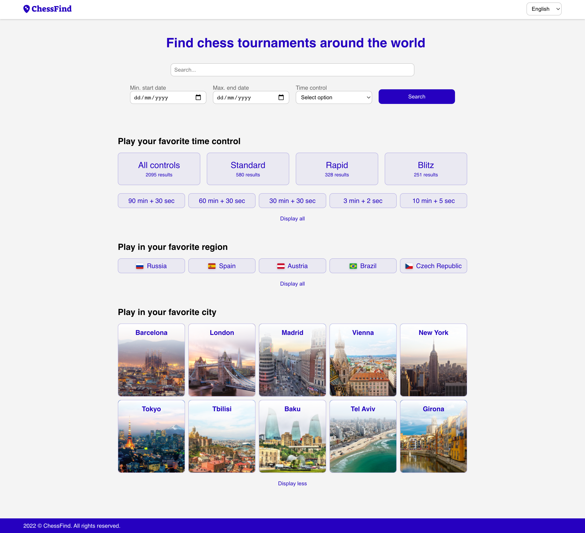
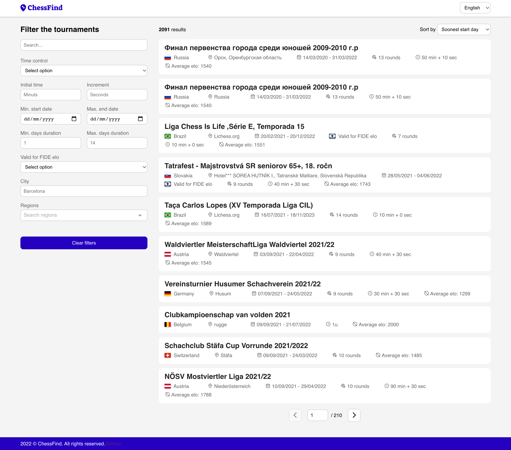

# ChessFind frontend

ChessFind [chessfind.vercel.app](https://chessfind.vercel.app/) website is here to solve the problem of finding chess tournaments around the world. We are open to any feature request and help building it.

<p align="center">


</p>

## Build Setup

```bash
# install dependencies
$ npm install

# serve with hot reload at localhost:3000
$ npm run dev

# build for production and launch server
$ npm run build
$ npm run start

# generate static project
$ npm run generate
```

For detailed explanation on how things work, check out [Nuxt.js docs](https://nuxtjs.org).
